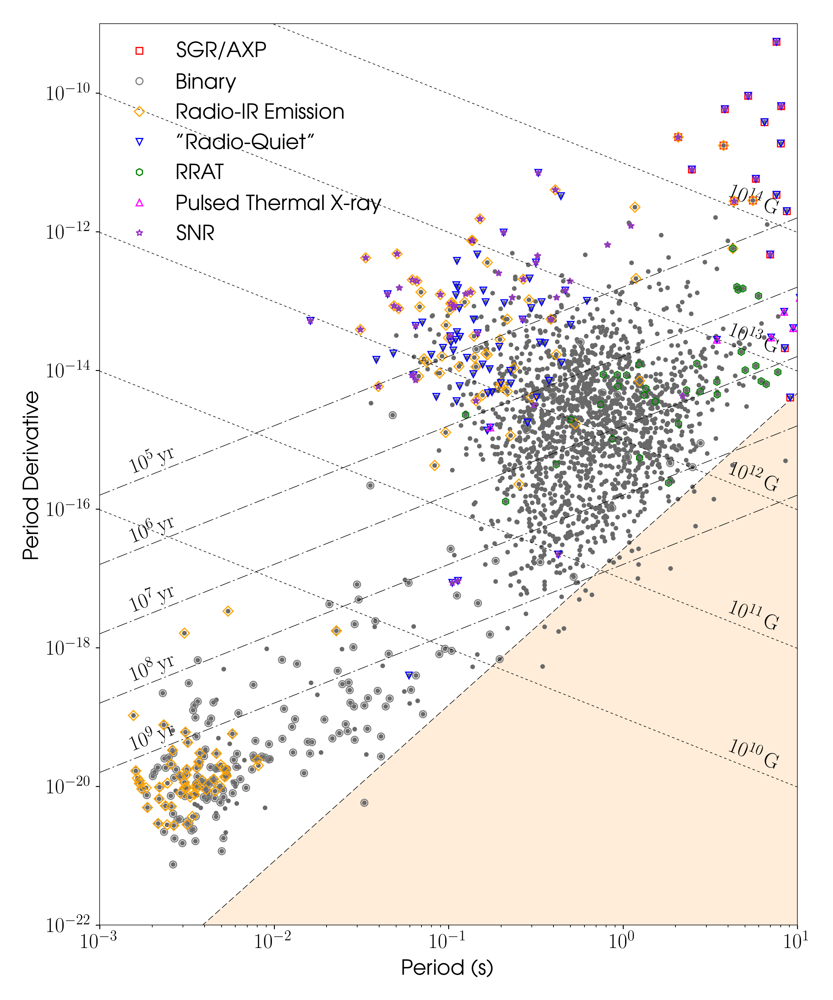

.. psrqpy documentation master file, created by
   sphinx-quickstart on Thu Nov 23 21:34:43 2017.
   You can adapt this file completely to your liking, but it should at least
   contain the root `toctree` directive.

.. include:: <isonum.txt>

.. _reference:

The psrqpy package
==================

.. automodule:: psrqpy

This package provides a way to directly query the `ATNF Pulsar Catalogue <http://www.atnf.csiro.au/people/pulsar/psrcat/>`_ [1]_ using Python. It does this by
downloading and parsing the full catalogue database, which itself is cached and can
be reused. It is primarily aimed at astronomers wanting access to the latest pulsar
information via a script, rather than through the standard web interface.

Other functionality that it includes:

 * it can produce a :math:`P-\dot{P}` :ref:`diagram <make-p-pdot-diagram>` using the latest catalogue information.
 * a function (:func:`~psrqpy.utils.get_glitch_catalogue`) to access the `Jodrell Bank pulsar glitch catalogue <http://www.jb.man.ac.uk/pulsar/glitches.html>`_.

Installation
============

This package can be installed using ``pip`` via ``pip install psrqpy`` or ``conda`` using ``conda install -c conda-forge psrqpy``. Alternatively
the source code can be obtained from `github <https://github.com/mattpitkin/psrqpy>`_, and installed using::

    python setup.py install

with ``sudo`` if wanted to install system wide, and with the ``--user`` flag
if just installing for an individual user.

Requirements
------------

The requirements for installing the code are:

 * :mod:`requests`
 * :mod:`bs4`
 * :mod:`numpy`
 * :mod:`astropy`
 * :mod:`pandas`
 * :mod:`scipy`
 * :mod:`ads`
 * :mod:`matplotlib`

Examples
========

Downloading the full database can be simply achieved via

    >>> from psrqpy import QueryATNF
    >>> query = QueryATNF()

From this query the database can then be accessed as an :class:`astropy.table.Table` via

    >>> table = query.table

or as a :class:`pandas.DataFrame` via

    >>> df = query.pandas

You can also specifically limit the query to any combination of the pulsar parameters
`listed here <http://www.atnf.csiro.au/research/pulsar/psrcat/psrcat_help.html?type=expert#par_list>`_.

A simple example of such a limited query is to get the frequency 'F0' for all pulsars in the
catalogue. This could be done with

    >>> from psrqpy import QueryATNF
    >>> query = QueryATNF(params=['F0'])

where the parameter names are case insensitive. This will also automatically include the
database uncertainty on ``'F0'``, stored as a variable called ``'F0_ERR'`` (parameter uncertainties
will always be stored using the uppercase version of the parameter name, with ``_ERR`` appended).
Again, the table, now only containing ``'F0'`` and ``'F0_ERR'``, can be accessed with

    >>> table = query.table

Note that the full catalogue is still stored in the :class:`psrqpy.QueryATNF`
(as a :class:`pandas.DataFrame`) and can accessed with

    >>> catalogue = query.catalogue

Other parameters could be selected using the same ``query`` object with, e.g.,

    >>> query.query_params = ['F1', 'RAJ']
    >>> print(query.table)
            F1_ERR             RAJ      RAJ_ERR           F1          
            1 / s2                                      1 / s2        
    ---------------------- ------------ ------- ----------------------
                     5e-18  00:02:58.17    0.02           -4.48354e-13
    2.4933208594475155e-17   00:06:04.8     0.2 -4.357078201884523e-15
                     5e-16   00:07:01.7     0.2             -3.612e-12
                        --     00:11:34   114.0                     --
                     9e-20  00:14:17.75    0.04            -3.6669e-16
                     4e-20            0      --           -1.22783e-15
                       ...          ...     ...                    ...
                     8e-19  23:39:38.74    0.01            -1.6952e-15
                        --     23:40:45     7.0                     --
                        --        23:43      --                     --
                     3e-20            2      --             -9.765e-16
                        --        23:52      --                     --
                        --        23:54     7.0                     --
                     9e-20 23:54:04.724   0.004          -1.821923e-14
    Length = 2659 rows

The number of pulsars can easily be accessed, e.g.,

    >>> numstring = 'Version {} of the ATNF catalogue contains {} pulsars'
    >>> print(numstring.format(query.get_version, query.num_pulsars))
    Version 1.59 of the ATNF catalogue contains 2659 pulsars

You can access a table row for a particular pulsar in the ATNF catalogue by giving the name as a
key to an instance of the :class:`~psrqpy.search.QueryATNF` class, e.g.

    >>> from psrqpy import QueryATNF
    >>> query = QueryATNF()
    >>> print(query["J0534+2200"])
       PSRJ    PSRJ_REF     RAJ      ...       TYPE_REF      BINCOMP_ORIG
                                     ...
    ---------- -------- ------------ ... ------------------- ------------
    J0534+2200       -- 05:34:31.973 ... cdt69,fhm+69,hjm+70           --

More complex queries
--------------------

**Setting conditions**

You can set `logical conditions <http://www.atnf.csiro.au/research/pulsar/psrcat/psrcat_help.html#condition>`_
on the parameters that you query. Let's say you want all pulsars with rotation frequencies between
100 and 200 Hz, then you could do the following:

    >>> from psrqpy import QueryATNF
    >>> query = QueryATNF(condition='F0 > 100 && F0 < 200')
    >>> print(query.num_pulsars)
    82

If you also wanted pulsars with this condition, but also in globular clusters, you could do

    >>> query = QueryATNF(condition='F0 > 100 && F0 < 200', assoc='GC')
    >>> print(len(query))
    33

This is equivalent to having ``condition='F0 > 100 && F0 < 200 && assoc(GC)'``.

**Save a query**

You can save a query as a `pickled object <https://docs.python.org/3/library/pickle.html>`_ for later
use, e.g., if using a previous ``query`` we had done:

    >>> query.save('atnfquery.pkl')

Then we could reload this with

    >>> oldquery = QueryATNF(loadquery='atnfquery.pkl')

**Query specific pulsars**

We might just want to get information on certain pulsars, such as the Crab pulsar (J0534+2200) and
J0537-6910, then we could get their sky positions with:

    >>> from psrqpy import QueryATNF
    >>> query = QueryATNF(params=['JNAME', 'RAJ', 'DECJ'], psrs=['J0534+2200', 'J0537-6910'])
    >>> print(query.table)
    RAJ_ERR     RAJ          DECJ     DECJ_ERR   JNAME   
    ------- ------------ ------------ -------- ----------
      0.005 05:34:31.973 +22:00:52.06     0.06 J0534+2200
       0.11 05:37:47.416 -69:10:19.88      0.6 J0537-6910

You can also access these pulsars using the :class:`psrqpy.pulsar.Pulsars` class. This
will create a dictionary of :class:`psrqpy.pulsar.Pulsar` objects keyed on the pulsar
names. The attributes of the :class:`~psrqpy.pulsar.Pulsar` objects are the parameters
that have been retrieved by the query. But, the  :class:`~psrqpy.pulsar.Pulsar` objects
themselves can query the ATNF Pulsar Catalogue if you request a parameter that they don't already
contain. E.g., so first lets get the :class:`psrqpy.pulsar.Pulsars`:

    >>> psrs = query.get_pulsars()
    >>> for psr in psrs:
    ...     print(psr)
    J0534+2200
    J0537-6910

    >>> print(psrs['J0534+2200'].keys()) # show attributes of the psr class
    ['DECJ', 'RAJ', 'DECJ_ERR', 'RAJ_ERR', 'JNAME']

What if we want the frequency of J0534+2200? Well, we just have to do

    >>> crab = psrs['J0534+2200']
    >>> print(crab.F0)
    29.946923

We can also get the whole ephemeris for the Crab with

    >>> print(query.get_ephemeris('J0534+2200'))
    NAME      J0534+2200
    JNAME     J0534+2200
    BNAME     B0531+21
    PSRJ      J0534+2200
    PSRB      B0531+21
    RAJ       05:34:31.973             	0.005000000000000
    DECJ      +22:00:52.06             	0.060000000000000
    PMRA      -14.699999999999999      	0.800000000000000
    PMDEC     2                        	0.800000000000000
    POSEPOCH  40706
    ELONG     84.097631599851169
    ELAT      -1.294467050350203
    PMELONG   -14.597441126565251
    PMELAT    2.646641750683564
    GL        184.557559483180171
    GB        -5.784269849609095
    RAJD      83.633220833333311
    DECJD     22.014461111111110
    TYPE      HE[cdt69,fhm+69,hjm+70]
    PML       -9.558486649099681
    PMB       -11.345718707027030
    DIST      2
    DIST_DM   1.310000000000000
    ...

.. note::
    This style of ephemeris is not completely equivalent to the pulsar ephemerides returned by
    `the ATNF Pulsar Catalogue <http://www.atnf.csiro.au/people/pulsar/psrcat/psrcat_help.html#boundary>`_.

**Query pulsars within a circular boundary**

We can query the catalogue to only return pulsars within a `circular boundary <http://www.atnf.csiro.au/research/pulsar/psrcat/psrcat_help.html?type=normal#boundary>`_ defined
by a central right ascension and declination, and with a given radius (in degrees).

    >>> from psrqpy import QueryATNF
    >>> # set the boundary circle centre (RAJ then DECJ) and radius
    >>> c = ['12:34:56.7', '-02:54:12.3', 10.]
    >>> query = QueryATNF(params=['JNAME', 'RAJ', 'DECJ'], circular_boundary=c)
    >>> print(query.table)
      JNAME         RAJ      DECJ_ERR      DECJ      RAJ_ERR
    ---------- ------------- -------- -------------- -------
    J1257-1027 12:57:04.7686       -- -10:27:05.7817      --
    J1312+0051         13:12       --         +00:51      --

The circle's coordinates can also be define as, e.g.:

    >>> c = ['12h34m56.7s', '-02d54m12.3s', 10.]

**Return a reference**

We can make use of the `ADS module <https://ads.readthedocs.io/en/latest/>`_ to return links to references for pulsars/pulsar parameters.
For example we could get the reference for the orbital period of J0737-3039A with

    >>> from psrqpy import QueryATNF
    >>> query = QueryATNF(params='PB', psrs='J0737-3039A', include_refs=True, adsref=True)
    >>> print(query.parse_ref(query.table['PB_REF'])[0])
    (" Kramer, M., Stairs, I. H., Manchester, R. N., McLaughlin, M. A., Lyne, A. G., Ferdman, R. D., Burgay, M., Lorimer, D. R., Possenti, A., D'Amico, N., Sarkissian, J. M., Hobbs, G. B., Reynolds, J. E., Freire, P. C. C. & Camilo, F., 2006. Tests of General Relativity from Timing the Double Pulsar. Science, 314, 97-102. ", 'https://ui.adsabs.harvard.edu/#abs/2006Sci...314...97K/')

.. note::
    To use this feature you need to have an API key from NASA ADS labs. Getting this
    is described `here <https://ads.readthedocs.io/en/latest/#getting-started>`_.

.. _make-p-pdot-diagram:

**Make a P-Pdot diagram**

You can generate a *lovely* period vs. period derivative diagram based on the latest catalogue information
using the :func:`~psrqpy.search.ppdot` function in just three lines of code:

    >>> from psrqpy import QueryATNF
    >>> query = QueryATNF(params=['P0', 'P1', 'ASSOC', 'BINARY', 'TYPE', 'P1_I'])
    >>> query.ppdot(showSNRs=True, showtypes='all')

where this shows all pulsar types and pulsars in supernova remnants, to give

Additional catalogues
=====================

In addition to returning a querying the ATNF Pulsar Catalogue, psrqpy can also
download and parse:

* the `Jodrell Bank pulsar glitch table <http://www.jb.man.ac.uk/pulsar/glitches/gTable.html>`_
* Paolo Freire's `table of pulsars in globular clusters <http://www.naic.edu/~pfreire/GCpsr.txt>`_
  (note that the downloaded table does not include accompanying notes or references, and binary
  parameters that are listed as upper/lower limits within the table are just returned as equalities.)
* Duncan Lorimer & Elizabeth Ferrara's `table of galactic millisecond pulsars
  <http://astro.phys.wvu.edu/GalacticMSPs/>`_ (accessed via the `JSON-ified version
  <https://github.com/astrogewgaw/galmsps>`_ by `Ujjwal Panda <https://github.com/astrogewgaw>`_)

Examples
--------

Accessing the glitch table can be achieved with the :func:`~psrqpy.utils.get_glitch_catalogue`
function using:

    >>> from psrqpy.utils import get_glitch_catalogue
    >>> glitches = get_glitch_catalogue()

The glitches for a single pulsar can be returned with, e.g.:

    >>> crabglitches = get_glitch_catalogue(psr="J0534+2200")

Accessing the globular cluster table can be achieved with the
:func:`~psrqpy.utils.get_gc_catalogue` function using:

    >>> from psrqpy.utils import get_gc_catalogue
    >>> gctable = get_gc_catalogue()

The pulsars with a single globular cluster, e.g., 47 Tuc, can the be returned with:

    >>> tucpulsars = gctable.cluster_pulsars("47 Tuc")

Accessing the MSP table can be achieved with the :func:`~psrqpy.utils.get_msp_catalogue` function
using:

    >>> from psrqpy.utils import get_msp_catalogue
    >>> msps = get_msp_catalogue()

Differences with the ATNF Pulsar Catalogue
==========================================

There are differences between some of the values returned by psrqpy and those
calculated by the ``psrcat`` software used to generation the ATNF Pulsar
Catalogue results. These are listed below:

 * The cartesian Galactic coordinates returned by :class:`psrqpy.QueryATNF`
   (``XX``, ``YY``, and ``ZZ``) *do not* match those returned by the ATNF
   Pulsar Catalogue and the ``psrcat`` software. The values returned by psrqpy
   are defined using the conventions in the :class:`astropy.coordinates.Galactocentric`
   class. This uses a Galactic centre distance of 8.3 kpc compared to 8.5 kpc in ``psrcat``
   and is rotated 90 degrees anticlockwise compared to ``psrcat``.

 * The Galactic coordinate proper motions returned by :class:`psrqpy.QueryATNF`
   (``PML`` and ``PMB``) *do not* match those returned by the ATNF
   Pulsar Catalogue and the ``psrcat`` software. The values returned by psrqpy
   purely convert the observed proper motions in right ascension and declination
   (or elliptic longitude and latitude) into equivalent values in the Galactic
   coordinate system (via the :class:`astropy.coordinates.Galactic` class).
   However, the values returned by the ATNF Pulsar Catalogue and the ``psrcat``
   software are in the Galactic cooridinate system, but additionally have the
   local solar system velocity and Galactic rotation of the pulsar removed
   from them as described in Section 3 of [2]_.

Development and Support
=======================

Code development is done via the package's `GitHib repository <https://github.com/mattpitkin/psrqpy>`_.
Any contributions can be made via a `fork and pull request <https://help.github.com/articles/creating-a-pull-request-from-a-fork/>`_ model
from that repository, and must adhere to the :ref:`MIT license <copyright-license-for-psrqpy>`. Any problems with the code
or support requests can be submitted via the repository's `Issue tracker <https://github.com/mattpitkin/psrqpy/issues>`_.

API interface
=============

.. toctree::
   :maxdepth: 2

   query
   pulsar
   config
   utils
   CHANGELOG

Test suite
==========

There are tests supplied that cover many of the functions within PSRQpy. These can be run from the
base directory of the repository (after installing the `pytest <https://docs.pytest.org/en/latest/>`_ and
`pytest-socket <https://pypi.org/project/pytest-socket/>`_ modules, e.g., with ``pip``) by just calling:

    pytest

These tests are not included in the ``pip`` installed version of the code.

Copyright and referencing for the catalogue
-------------------------------------------

Regarding the use of the catalogue and software behind it, the `following statements <http://www.atnf.csiro.au/research/pulsar/psrcat/download.html>`_ apply:

    PSRCAT is free software: you can redistribute it and/or modify it under the terms of the GNU General Public License as published by the Free Software Foundation, either version 3 of the License, or (at your option) any later version. PSRCAT is distributed in the hope that it will be useful, but WITHOUT ANY WARRANTY; without even the implied warranty of MERCHANTABILITY or FITNESS FOR A PARTICULAR PURPOSE. See the GNU General Public License for more details.

    PSRCAT makes use of "evaluateExpression: A Simple Expression Evaluator". Copyright |copy| 1996 - 1999 Parsifal Software, All Rights Reserved.

    The programs and databases remain the property of the Australia Telescope National Facility, CSIRO, and are covered by the `CSIRO Legal Notice and Disclaimer <http://www.csiro.au/en/About/Footer/Legal-notice>`_.

    If you make use of information from the ATNF Pulsar Catalogue in a publication, we would appreciate acknowledgement by reference to the publication "*The ATNF Pulsar Catalogue*", R. N. Manchester, G. B. Hobbs, A. Teoh & M. Hobbs, Astronomical Journal, 129, 1993-2006 (2005) and by quoting the web address http://www.atnf.csiro.au/research/pulsar/psrcat for updated versions.

.. _copyright-license-for-psrqpy:

Copyright & license for psrqpy
------------------------------

This code is licensed under the `MIT License <http://opensource.org/licenses/MIT>`_.

If making use of this code to access the catalogue, or produce plots, I would be grateful if (as well as citing the `ATNF pulsar catalogue paper <http://adsabs.harvard.edu/abs/2005AJ....129.1993M>`_ and `URL <http://www.atnf.csiro.au/research/pulsar/psrcat>`_ given above) you consider citing the `JOSS <http://joss.theoj.org/>`_ `paper <https://doi.org/10.21105/joss.00538>`_ for this software:

.. code-block:: tex

    @article{psrqpy,
      author = {{Pitkin}, M.},
       title = "{psrqpy: a python interface for querying the ATNF pulsar catalogue}",
      volume = 3,
      number = 22,
       pages = 538,
       month = feb,
        year = 2018,
     journal = "{Journal of Open Source Software}",
         doi = {10.21105/joss.00538},
         url = {https://doi.org/10.21105/joss.00538}
    }

|copy| Matt Pitkin, 2017

References
----------

.. [1] Manchester, Hobbs, Teoh & Hobbs, *AJ*, **129**, 1993-2006 (2005), `arXiv:astro-ph/0412641 <https://arxiv.org/abs/astro-ph/0412641>`_

.. [2] `Harrison, Lyne & Anderson <https://ui.adsabs.harvard.edu/?#abs/1993MNRAS.261..113H>`_,
 *MNRAS*, **261**, 113-124 (1993)
