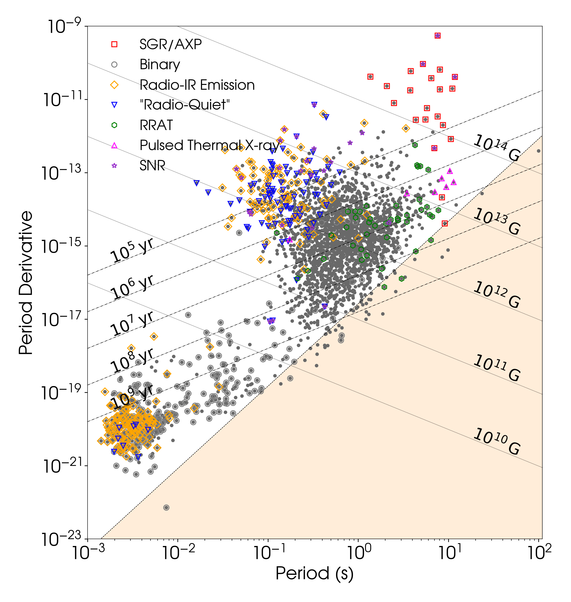

.. psrqpy documentation master file, created by
   sphinx-quickstart on Thu Nov 23 21:34:43 2017.
   You can adapt this file completely to your liking, but it should at least
   contain the root `toctree` directive.

.. include:: <isonum.txt>

.. _reference:

The psrqpy package
==================

.. automodule:: psrqpy

This package provides a way to directly query the `ATNF Pulsar Catalogue <http://www.atnf.csiro.au/people/pulsar/psrcat/>`_ [1]_ using python.

Installation
============

This package can be installed using ``pip`` via ``pip install psrqpy``. Alternatively
the source code can be obtained from `github <https://github.com/mattpitkin/psrqpy>`_, and installed using::

    python setup.py install

with ``sudo`` if wanted to install system wide, and with the ``--user`` flag
if just installing for an individual user.

Requirements
------------

The requirements for installing the code are:

 * :mod:`six`
 * :mod:`requests`
 * :mod:`bs4`
 * :mod:`numpy`
 * :mod:`astropy`
 * :mod:`datetime`

The :mod:`ads` module and :mod:`matplotlib` are optional requirement to get the full functionality.

Examples
========

You can query the ATNF catalogue for any combination of the pulsar parameters listed
`here <http://www.atnf.csiro.au/research/pulsar/psrcat/psrcat_help.html?type=normal#par_list>`_.

A simple example of a query is to get the 'JName' (pulsar name based on the J2000 coordinates) and frequency 'F0' for all pulsars in the catalogue. This could be done with

   >>> from psrqpy import QueryATNF
   >>> query = QueryATNF(params=['JName', 'F0'])

where the parameter names are case insensitive. The returned :class:`~psrqpy.search.QueryATNF` query will
contain a dictionary keyed on the parameter names (converted
to upper case), with the
dictionary values being :class:`numpy.ndarray` arrays containing the parameter values. This can
be accessed with

   >>> qdict = query.get_dict()

or, perhaps more conveniently, the output can be viewed as an :class:`astropy.table.Table` via

   >>> qtable = query.table()

The number of pulsars can easily be accessed, e.g.,

   >>> numstring = 'Version {} of the ATNF catalogue contains {} pulsars'
   >>> print(numstring.format(query.get_version, query.num_pulsars))
   Version 1.57 of the ATNF catalogue contains 2627 pulsars

The code will automatically attempt to query the current version of the
ATNF catalogue, the value of which is printed in the above example.

.. note::

   If you really want to query the catalogue many times in quick succession it is advisable not to use this module, as
   it could result in too much load on the ATNF catalogue's server. Instead it is probably preferable to `download
   the catalogue <http://www.atnf.csiro.au/research/pulsar/psrcat/download.html>`_ and query it with the ``psrcat`` software
   provided.

More complex queries
--------------------

**Setting conditions**

You can set `logical conditions <http://www.atnf.csiro.au/research/pulsar/psrcat/psrcat_help.html#condition>`_
on the parameters that you query. Let's say you want the names of all pulsars with rotation frequencies between
100 and 200 Hz, then you could do the following:

    >>> from psrqpy import QueryATNF
    >>> query = QueryATNF(params=['JName'], condition='F0 > 100 && F0 < 200')
    >>> print(len(query))
    82

If you also wanted pulsars with this condition, but also in globular clusters, you could do

    >>> query = QueryATNF(params=['JName'], condition='F0 > 100 && F0 < 200', assoc='GC')
    >>> print(len(query))
    33

This is equivalent to having ``condition='F0 > 100 && F0 < 200 && assoc(GC)'``.

**Save a query**

You can save a query as a `pickled object <https://docs.python.org/3/library/pickle.html>`_ for later
use, e.g., if using a previous ``query`` we had done:

    >>> query.save('atnfquery.pkl')

The we could reload this with

   >>> oldquery = QueryATNF(loadfromfile='atnfquery.pkl')

**Query specific pulsars**

We might just want to get information on certain pulsars, such as the Crab pulsar (J0534+2200) and
J0537-6910, then we could get their sky positions with:

    >>> from psrqpy import QueryATNF
    >>> query = QueryATNF(params=['RAJ', 'DECJ'], psrs=['J0534+2200', 'J0537-6910'])
    >>> print(query.table())
        RAJ      RAJ_ERR     DECJ     DECJ_ERR
    ------------ ------- ------------ --------
    05:34:31.973   0.005 +22:00:52.06     0.06
    05:37:47.416    0.11 -69:10:19.88      0.6

You can also access these pulsars using the :class:`psrqpy.pulsar.Pulsars` class. This
will create a dictionary of :class:`psrqpy.pulsar.Pulsar` objects keyed on the pulsar
names. The attributes of the :class:`~psrqpy.pulsar.Pulsar` objects are the parameters
that have been retrieved by the query. But, the  :class:`~psrqpy.pulsar.Pulsar` objects
themselves can query the ATNF catalogue if you request a parameter that they don't already
contain. E.g., so first lets get the :class:`psrqpy.pulsar.Pulsars`:

    >>> psrs = query.get_pulsars()
    >>> for psr in psrs:
    ...     print(psr)
    J0534+2200
    J0537-6910

    >>> print(psrs['J0534+2200'].keys()) # show attributes of the psr class
    ['DECJ', 'RAJ', 'DECJ_ERR', 'RAJ_ERR', 'JNAME']

What if we want the frequency of J0534+2200? Well we just have to do

    >>> crab = psrs['J0534+2200']
    >>> print(crab.F0)
    29.946923

We can also get the whole ephemeris for the Crab with

    >>> print(crab.get_ephemeris())
    PSRJ            J0534+2200
    PSRB            B0531+21
    NAME            B0531+21
    RAJ             05:34:31.973             5.000e-03
    DECJ            +22:00:52.06             6.000e-02
    ELONG           84.10
    ELAT            -1.29
    DM              56.77118                 2.400e-04
    PEPOCH          48442.5
    F0              29.946923                1.000e-06
    F1              -3.77535E-10             2.000e-15
    P0              0.0333924123             1.200e-09
    P1              4.20972E-13              3.000e-18
    DIST_DM         1.31
    ...

**Make a P-Pdot diagram**

You can generate a *lovely* period vs. period derivative diagram based on the latest catalogue information
using the :func:`~psrqpy.search.ppdot` function in just three lines of code:

    >>> from psrqpy import QueryATNF
    >>> query = QueryATNF(params=['P0', 'P1', 'ASSOC', 'BINARY', 'TYPE', 'P1_I'])
    >>> query.ppdot(showSNRs=True, showtypes='all')

where this shows all pulsar types and pulsars in supernova remnants, to give

API interface
=============

.. toctree::
   :maxdepth: 2

   query
   pulsar
   config
   utils

Copyright and referencing for the catalogue
-------------------------------------------

Regarding the use of the catalogue and software behind it, the `following statements <http://www.atnf.csiro.au/research/pulsar/psrcat/download.html>`_ apply:

    PSRCAT is free software: you can redistribute it and/or modify it under the terms of the GNU General Public License as published by the Free Software Foundation, either version 3 of the License, or (at your option) any later version. PSRCAT is distributed in the hope that it will be useful, but WITHOUT ANY WARRANTY; without even the implied warranty of MERCHANTABILITY or FITNESS FOR A PARTICULAR PURPOSE. See the GNU General Public License for more details.

    PSRCAT makes use of "evaluateExpression: A Simple Expression Evaluator". Copyright |copy| 1996 - 1999 Parsifal Software, All Rights Reserved.

    The programs and databases remain the property of the Australia Telescope National Facility, CSIRO, and are covered by the `CSIRO Legal Notice and Disclaimer <http://www.csiro.au/en/About/Footer/Legal-notice>`_.

    If you make use of information from the ATNF Pulsar Catalogue in a publication, we would appreciate acknowledgement by reference to the publication "`The ATNF Pulsar Catalogue <http://adsabs.harvard.edu/abs/2005AJ....129.1993M>`_", R. N. Manchester, G. B. Hobbs, A. Teoh & M. Hobbs, Astronomical Journal, 129, 1993-2006 (2005) and by quoting the web address http://www.atnf.csiro.au/research/pulsar/psrcat for updated versions.

Copyright & license for psrqpy
------------------------------

This code is licensed under the `MIT License <http://opensource.org/licenses/MIT>`_.

|copy| Matt Pitkin, 2017

References
----------

.. [1] Manchester, Hobbs, Teoh & Hobbs, *AJ*, **129**, 1993-2006 (2005), `arXiv:astro-ph/0412641 <https://arxiv.org/abs/astro-ph/0412641>`_
